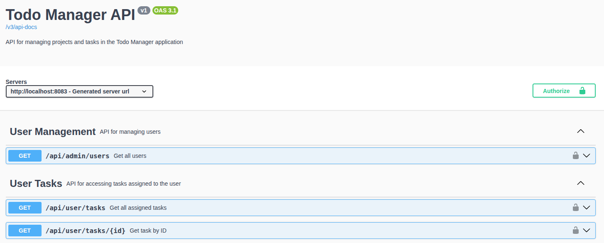
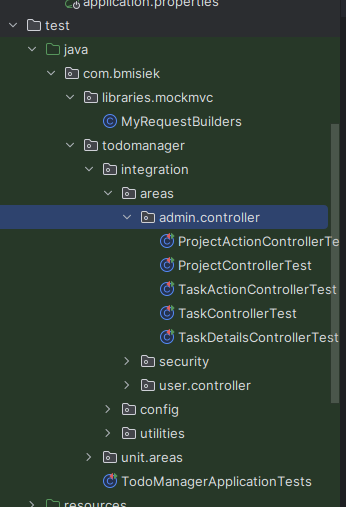
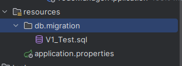
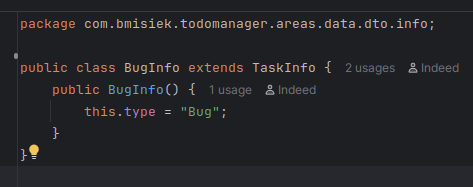
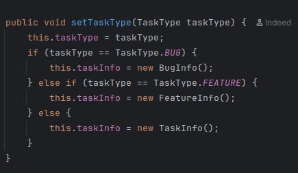
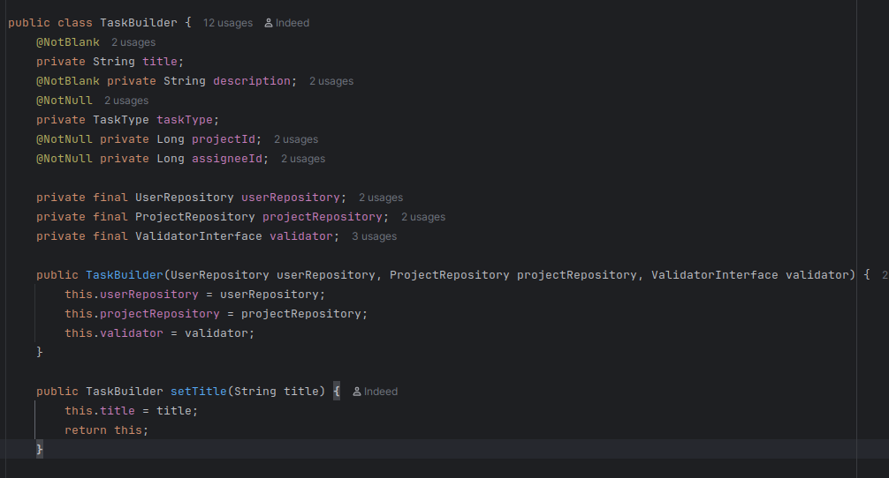
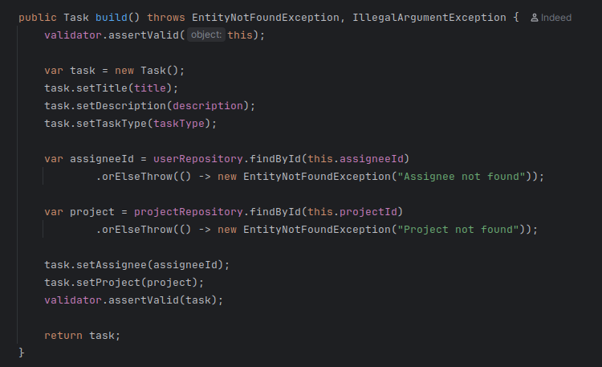
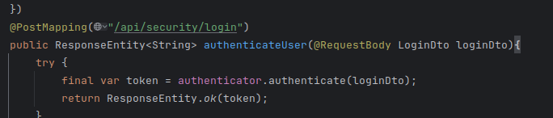
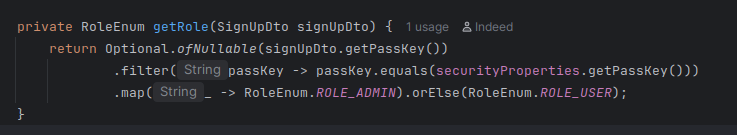
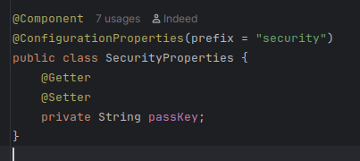

## Dokumentacja na potrzeby oddawania projektu

### Działanie projektu

Projekt został stworzony używając
- Springboot security z 2 typami ról ADMIN i USER

- Wykorzystywany jest JWT do autoryzacji

- Baza danych to PostgreSQL

- Wykorzystano Swagger do dokumentacji API z wsparciem tokenów JWT
  - 

- Zostały dodane testy jednostkowe i integracyjne (z naciskiem na integracyjne) z użyciem H2
  - 

- Korzysta z flyway do migracji bazy danych, migracje w src/main/resources/db/migration
  - 
- Korzysta z docker-compose.yml

- Polimorfizm został użyty w typach tasków zwracanych z api i klasę TaskInfo
  - 
  - 

- Wykorzystano wzorzec projektowy Builder do tworzenia tasków
  - 
  - 

- Korzysta z klas DTO do komunikacji z API i serwisami
  - 

- .env i .env.local pliki do konfiguracji środowiska
- Tworzenie użytkowników o różnych rolach jest zaimplementowane używając PASSKEY w .env
  - 
  - 

### ERD

### Coverage
